# Enhancing β-Carotene Production in *Haematococcus pluvialis*: Machine Learning-Driven Stress Optimization

[](https://www.python.org/downloads/)
[](https://www.cs.waikato.ac.nz/ml/weka/)
[](https://opensource.org/licenses/MIT)
[](https://github.com)

## 📋 Table of Contents
- [Overview](#overview)
- [Project Highlights](#project-highlights)
- [Research Background](#research-background)
- [Methodology](#methodology)
- [Experimental Design](#experimental-design)
- [Machine Learning Analysis](#machine-learning-analysis)
- [Results Summary](#results-summary)
- [Installation & Setup](#installation--setup)
- [Project Structure](#project-structure)
- [Usage Guide](#usage-guide)
- [Visualization Gallery](#visualization-gallery)
- [Key Findings](#key-findings)
- [Future Work](#future-work)
- [Contributors](#contributors)
- [Citation](#citation)
- [License](#license)

## 🔬 Overview

This project applies **Design of Experiments (DoE)** combined with **Machine Learning** to optimize β-carotene production in *Haematococcus pluvialis*, a freshwater microalgae with significant commercial potential. Using **Plackett-Burman screening** and **Response Surface Methodology (RSM)**, we identified critical stress factors and developed predictive models to maximize β-carotene yield.

### The Challenge
- **Market Opportunity**: β-carotene market valued at $575M (2022), projected $955M by 2032 (CAGR: 5%)
- **Production Bottleneck**: Optimizing environmental stress conditions for maximum carotenoid accumulation
- **Complex Interactions**: Multiple interacting factors (nutrients, light, aeration, pH regulators)

### Our Approach
- **Systematic screening** of 10 stress parameters using Plackett-Burman design
- **Machine learning models** (Linear Regression, SMOreg) for yield prediction
- **Response Surface Methodology** for multi-factor optimization
- **Advanced visualization** (3D surface plots, contour maps, parallel coordinates)

## ✨ Project Highlights

### 🎯 Optimization Achievement
- **Best β-Carotene Yield**: 11.42 mg/L (Experiment 14)
- **Best Biomass Yield**: 42.51 g/L (Experiment 9)
- **Model Accuracy**: R = 0.9816 (training), R² correlation for predictions

### 🧬 Critical Success Factors Identified
1. **2-Sparger (Aeration)** - Enhanced oxygen transfer and mixing
2. **Vitamin B3 (Niacin)** - Supports carotenoid biosynthesis
3. **Na₂CO₃ (Carbon Source)** - Improves photosynthetic efficiency
4. **Micronutrients** - Essential enzyme cofactors
5. **Reactor Light** - Triggers stress-induced pigment accumulation

### 📊 Machine Learning Models Developed
- **Linear Regression** (WEKA): 8 predictor variables, correlation coefficient 0.9816
- **SMOreg** (Support Vector Machine): Non-linear optimization
- **Principal Component Analysis**: Feature reduction and correlation analysis
- **Response Surface Models**: 3D prediction surfaces for optimal conditions

## 🌱 Research Background

### *Haematococcus pluvialis* Biology

| Growth Stage | Characteristics | Key Product |
|-------------|----------------|-------------|
| **Green Cell Stage** | Active growth, photosynthesis | **β-Carotene** (provitamin A) |
| **Red Cyst Stage** | Stress-induced, dormant | **Astaxanthin** ($7,000/kg) |

### β-Carotene Significance
- **Provitamin A**: Essential nutrient for vision and immune function
- **Antioxidant**: Protects against oxidative stress
- **Market Applications**: Food coloring, dietary supplements, cosmetics
- **Commercial Value**: Growing 5% annually ($955M by 2032)

### Stress-Induced Production
Carotenoid accumulation is triggered by:
- High light intensity
- Nutrient deprivation
- Osmotic stress
- pH fluctuations
- Temperature variations

## 🔄 Methodology

### Overall Workflow

```mermaid
graph TD
    A[Literature Review] --> B[Parameter Selection]
    B --> C[Plackett-Burman Design - 16 runs]
    C --> D[Laboratory Experiments]
    D --> E[Biomass & β-Carotene Quantification]
    E --> F[Data Collection]
    F --> G[WEKA Machine Learning Analysis]
    G --> H[Factor Screening]
    H --> I[CCD - Response Surface Methodology]
    I --> J[3D Surface & Contour Plots]
    J --> K[Optimal Condition Prediction]
    K --> L[Validation Experiments]
```



### Experimental Pipeline


## 🧪 Experimental Design

### Plackett-Burman Screening Design

**Objective**: Screen 10 factors in 16 experiments to identify significant variables

#### Factors Investigated

| Factor | Symbol | Low Level (-1) | High Level (+1) | Description |
|--------|--------|---------------|-----------------|-------------|
| **Vitamin C** | VitC7 | 0 g | 0.07 g | Ascorbate - antioxidant cofactor |
| **Aspirin** | Asp5 | 0 g | 0.05 g | Salicylic acid - stress inducer |
| **2-Sparger** | 2spar | 0 (single) | 1 (double) | Aeration system |
| **Vitamin B3** | VitB3 | 0 g | 1 g | Niacin - metabolic cofactor |
| **Reactor Light** | Light | 0 (off) | 1 (on) | Photonic stress |
| **Light:Dark Cycle** | 8:16 | 0 (16:8) | 1 (8:16) | Photoperiod |
| **Dextrose** | Dex3 | 0 g | 3 g | Carbon/energy source |
| **Sodium Carbonate** | Na2CO3-2 | 0 g | 2 g | pH buffer, CO₂ source |
| **Isopropanol** | El1 | 0 mL | 1 mL | Organic stress inducer |
| **Micronutrients** | micronutrients | 0 | 1 | Trace metal mix |

#### Response Variables
- **Biomass Yield** (g/L) - Dry weight concentration
- **β-Carotene (Acetone extract)** (mg/L) - Initial screening
- **β-Carotene (DCM extract)** (mg/L) - HPLC-validated measurement

### Central Composite Design (CCD)

**Objective**: Optimize the 5 most influential factors identified from Plackett-Burman

**Design Parameters**:
- **Factors**: 5 (2-Sparger, VitB3, ReactorLight, Na2CO3_2, micronutrients)
- **Center Points**: 6 replicates
- **Axial Points**: α = ±1.69 (rotatable design)
- **Total Runs**: 58 experiments
- **Design Type**: Face-centered central composite

## 🤖 Machine Learning Analysis

### WEKA Models Implemented

#### 1. Linear Regression - Biomass Yield

```
Biomass yield (g/L) = 
    -12.5608 × (8:16) +
     13.5869 × (Dex3) +
      6.4699 × (Na2CO3-2) +
      7.3492 × (micronutrients) +
     17.7372

Model Performance:
├─ Correlation coefficient: 0.8603
├─ Mean absolute error: 5.47 g/L
├─ Root mean squared error: 6.20 g/L
├─ Relative absolute error: 50.27%
└─ Total instances: 16
```

**Key Insights**:
- **Dextrose** has the strongest positive effect (+13.59)
- **8:16 light cycle** negatively impacts biomass (-12.56)
- **Micronutrients** and **Na₂CO₃** are significant positive contributors

#### 2. Linear Regression - β-Carotene (DCM)

```
Beta carotene (mg/L) - DCM =
    -4.5957 × Experiments +
     1.0088 × 2spar +
     0.9629 × ReactorLight +
     1.9960 × Dex3 +
    -1.0531 × Na2CO3-2 +
    -1.2147 × micronutrients +
    -6.3750 × Biomass yield +
    12.4012 × Beta carotene (Acetone) +
     6.3094

Model Performance (Training):
├─ Correlation coefficient: 0.9816
├─ Mean absolute error: 0.35 mg/L
├─ Root mean squared error: 0.42 mg/L
└─ Relative absolute error: 19.56%

Model Performance (10-fold CV):
├─ Correlation coefficient: -0.5685
├─ Mean absolute error: 1.99 mg/L
└─ Root relative squared error: 105.48%
```

**Key Insights**:
- Strong correlation between **acetone** and **DCM** extraction methods (coefficient: 12.40)
- **2-Sparger** and **Reactor Light** positively correlate with β-carotene
- Inverse relationship with biomass (-6.38) suggests stress-induced accumulation

#### 3. SMOreg (Support Vector Regression)

Applied for non-linear relationship modeling with polynomial kernel for complex interactions.

### Feature Selection Methods

#### Principal Component Analysis (PCA)
- **Objective**: Reduce dimensionality, identify correlated variables
- **Key Components**: PC1 explains variance in aeration/nutrient factors
- **Application**: Simplified 10 features to 3-4 principal components

#### Correlation Attribute Evaluator
- **Method**: Pearson correlation with target variable
- **Top Correlates for β-Carotene**: VitB3 (r=0.45), 2-Sparger (r=0.38), ReactorLight (r=0.32)
- **Top Correlates for Biomass**: Dex3 (r=0.56), micronutrients (r=0.48)

## 📈 Results Summary

### Plackett-Burman Top Performers

#### Highest Biomass Yield

| Rank | Experiment | Biomass (g/L) | Key Active Factors |
|------|-----------|---------------|-------------------|
| 🥇 1st | Exp 9 | **42.51** | 2-Spar, VitB3, Light, micronutrients |
| 🥈 2nd | Exp 1 | **42.26** | 2-Spar, Na2CO3, micronutrients |
| 🥉 3rd | Exp 7 | **36.94** | 2-Spar, VitB3, Light, Na2CO3 |
| 4th | Exp 5 | **34.71** | VitB3, Light, Na2CO3, micronutrients |
| 5th | Exp 14 | **34.49** | 2-Spar, VitB3, Light, Na2CO3 |

#### Highest β-Carotene Yield (DCM Extract)

| Rank | Experiment | β-Carotene (mg/L) | Key Active Factors |
|------|-----------|-------------------|-------------------|
| 🥇 1st | Exp 14 | **11.42** | 2-Spar, VitB3, Light, Na2CO3, micronutrients |
| 🥈 2nd | Exp 13 | **9.15** | VitB3, Light, micronutrients |
| 🥉 3rd | Exp 11 | **8.43** | 2-Spar, VitB3, Na2CO3 |
| 4th | Exp 3 | **7.82** | VitC, 2-Spar, VitB3, Asp |
| 5th | Exp 12 | **6.95** | 2-Spar, VitB3, Na2CO3, micronutrients |

### Factor Influence Analysis

#### Top 5 Factors for Biomass Production

1. **2-Sparger (Aeration)** - 80% presence in top performers
   - Enhances O₂/CO₂ exchange
   - Improves nutrient distribution
   - Prevents cell settling

2. **Micronutrients** - 80% presence
   - Essential enzyme cofactors
   - Supports photosynthetic machinery
   - Enables metabolic flux

3. **Na₂CO₃** - 60% presence
   - Inorganic carbon source
   - pH stabilization (optimal: 7.0-7.5)
   - Bicarbonate buffering

4. **Vitamin B3 (Niacin)** - 60% presence
   - NAD+/NADP+ synthesis
   - Energy metabolism
   - Redox balance

5. **Reactor Light** - 40% presence
   - Photosynthetic photon flux
   - Biomass accumulation driver

#### Top 5 Factors for β-Carotene Production

1. **Vitamin B3** - 80% presence in top performers
   - Supports carotenoid biosynthesis pathway
   - NAD(P)H-dependent reactions
   - Redox cofactor availability

2. **2-Sparger** - 60% presence
   - Mild oxidative stress induction
   - Enhanced mixing prevents photoinhibition
   - Uniform light distribution

3. **Na₂CO₃** - 60% presence
   - Carbon availability for synthesis
   - Metabolic precursor supply

4. **Micronutrients** - 60% presence
   - Mg²⁺ for chlorophyll
   - Fe²⁺/Fe³⁺ for electron transport
   - Cofactors for carotenoid enzymes

5. **Reactor Light** - 60% presence
   - Light stress triggers carotenogenesis
   - ROS formation → antioxidant response
   - Photoprotection mechanism

### Response Surface Methodology Results

**Optimal Conditions Predicted** (from 3D surface analysis):

| Factor | Optimal Level (Coded) | Optimal Level (Actual) | Predicted β-Carotene |
|--------|----------------------|------------------------|---------------------|
| 2-Sparger | +1.5 | High flow rate | **~12-13 mg/L** |
| Reactor Light | +1.2 | High intensity | |
| VitB3 | +1.0 | 1.0 g/L | |
| Na2CO3_2 | +0.5 | 1.0 g/L | |
| Micronutrients | +1.0 | Present | |

## 🛠️ Installation & Setup

### Prerequisites

```bash
# System Requirements
- Python 3.8 or higher
- WEKA 3.8+ (for machine learning)
- Java Runtime Environment (for WEKA)
- 4GB RAM minimum
- 10GB free disk space
```

### Python Dependencies

```bash
# Create virtual environment
python -m venv hpluvialis_env
source hpluvialis_env/bin/activate  # On Windows: hpluvialis_env\Scripts\activate

# Install required packages
pip install -r requirements.txt
```

### Requirements.txt

```txt
# Core Scientific Libraries
numpy==1.24.3
pandas==2.0.3
scipy==1.11.1

# Visualization
matplotlib==3.7.2
seaborn==0.12.2

# Machine Learning (Python-based)
scikit-learn==1.3.0

# Statistical Analysis
statsmodels==0.14.0

# 3D Plotting
mpl-toolkits==1.0.0

# Data Processing
openpyxl==3.1.2
xlrd==2.0.1

# Jupyter (optional for notebooks)
jupyter==1.0.0
ipython==8.14.0
```

### WEKA Setup

```bash
# Download WEKA from official website
wget https://prdownloads.sourceforge.net/weka/weka-3-8-6.zip

# Extract
unzip weka-3-8-6.zip

# Run WEKA Explorer
java -jar weka.jar
```

## 📁 Project Structure

```
H.pluvialis-BetaCarotene-Optimization/
│
├── data/
│   ├── raw/
│   │   ├── plackett_burman_results.csv        # PB experimental data
│   │   ├── CCD_experiments.csv                # Central Composite Design
│   │   └── hplc_calibration.csv               # HPLC standards
│   │
│   ├── processed/
│   │   ├── CCD_PredictionFinal_DCM.csv       # RSM prediction data
│   │   ├── normalized_data.csv                # Scaled features
│   │   └── training_validation_split.csv      # ML dataset
│   │
│   └── weka/
│       ├── CCD-BetaDCM_csv.arff              # WEKA format dataset
│       ├── PrincipalComponentAnalysisDCMdata # PCA results
│       └── CorrelationAttributeEvaluatorReducedDCMdata
│
├── analysis/
│   ├── weka_models/
│   │   ├── Linear_Regression_model.docx       # Model documentation
│   │   ├── Beta_caro_in_DCM_Linear_Regression.docx
│   │   └── Beta_caro_in_DCM_smo_Regression.docx
│   │
│   ├── feature_selection/
│   │   ├── Choosing_the_most_influential_factors.docx
│   │   └── correlation_analysis.py
│   │
│   └── statistical_tests/
│       ├── anova.py
│       └── regression_diagnostics.py
│
├── visualization/
│   ├── scripts/
│   │   ├── 2D_Contour_Plots.py               # Contour map generation
│   │   ├── Beta_DCM_PredRSM.py               # 3D RSM surface plots
│   │   ├── Contour_and_parallel_plots.py     # Comprehensive viz
│   │   └── heatmap_generator.py
│   │
│   └── outputs/
│       ├── 2D_contour_plots.png              # Feature interaction maps
│       ├── Parallel_Co-ordinate_Plots.png    # Parallel coordinates
│       ├── RSM_Final.png                      # 3D response surface
│       └── factor_importance.png
│
├── models/
│   ├── linear_regression/
│   │   ├── biomass_model.pkl
│   │   └── beta_carotene_model.pkl
│   │
│   └── svm/
│       └── smoreg_model.pkl
│
├── presentations/
│   ├── First_review_final_HRRSB.pptx         # Project presentation
│   └── poster.pdf
│
├── notebooks/
│   ├── 01_data_exploration.ipynb
│   ├── 02_plackett_burman_analysis.ipynb
│   ├── 03_CCD_optimization.ipynb
│   ├── 04_machine_learning_models.ipynb
│   └── 05_response_surface_methodology.ipynb
│
├── docs/
│   ├── methodology.md
│   ├── experimental_protocol.md
│   ├── hplc_method.md
│   └── WEKA_tutorial.md
│
├── requirements.txt
├── README.md
├── LICENSE
└── .gitignore
```

## 💻 Usage Guide

### 1. Data Preprocessing

```python
import pandas as pd
import numpy as np

# Load experimental data
df = pd.read_csv('data/raw/plackett_burman_results.csv')

# Normalize features (0-1 scaling)
from sklearn.preprocessing import MinMaxScaler

scaler = MinMaxScaler()
features = ['VitC7', 'Asp5', '2spar', 'VitB3', 'ReactorLight', 
            '8:16', 'Dex3', 'Na2CO3_2', 'El1', 'micronutrients']
df[features] = scaler.fit_transform(df[features])

# Save processed data
df.to_csv('data/processed/normalized_data.csv', index=False)
```

### 2. Linear Regression Model Training

```python
from sklearn.linear_model import LinearRegression
from sklearn.model_selection import train_test_split
from sklearn.metrics import r2_score, mean_absolute_error

# Prepare data
X = df[features]
y = df['BetacaroteneDCM']

# Split dataset
X_train, X_test, y_train, y_test = train_test_split(
    X, y, test_size=0.2, random_state=42
)

# Train model
model = LinearRegression()
model.fit(X_train, y_train)

# Evaluate
y_pred = model.predict(X_test)
print(f"R² Score: {r2_score(y_test, y_pred):.4f}")
print(f"MAE: {mean_absolute_error(y_test, y_pred):.4f} mg/L")

# Feature importance
coefficients = pd.DataFrame({
    'Feature': features,
    'Coefficient': model.coef_
}).sort_values('Coefficient', ascending=False)
print(coefficients)
```

### 3. Generate 3D Response Surface Plot

```python
import matplotlib.pyplot as plt
from mpl_toolkits.mplot3d import Axes3D
from scipy.interpolate import griddata
import numpy as np

# Load CCD data
data = pd.read_csv("data/processed/CCD_PredictionFinal_DCM.csv")

# Select two most important factors
x = data["2spar"]
y = data["ReactorLight"]
z = data["BetacaroteneDCM"]

# Create interpolation grid
xi = np.linspace(x.min(), x.max(), 100)
yi = np.linspace(y.min(), y.max(), 100)
xi, yi = np.meshgrid(xi, yi)
zi = griddata((x, y), z, (xi, yi), method='cubic')

# Plot 3D surface
fig = plt.figure(figsize=(12, 8))
ax = fig.add_subplot(111, projection='3d')
surf = ax.plot_surface(xi, yi, zi, cmap='viridis', alpha=0.8, 
                        edgecolor='none')
ax.scatter(x, y, z, color='red', s=50, depthshade=True, 
           label='Experimental Points')

# Labels
ax.set_xlabel('2-Sparger Rate (Normalized)', fontsize=12)
ax.set_ylabel('Reactor Light Intensity (Normalized)', fontsize=12)
ax.set_zlabel('β-Carotene in DCM (mg/L)', fontsize=12)
ax.set_title('RSM Surface: 2-Sparger × Reactor Light Effect', fontsize=14)

# Colorbar
fig.colorbar(surf, ax=ax, shrink=0.5, aspect=10)
plt.tight_layout()
plt.savefig('visualization/outputs/3D_RSM_surface.png', dpi=300)
plt.show()
```

### 4. Generate Contour Plots

```python
from visualization.scripts.Contour_and_parallel_plots import *

# Run the complete visualization script
# This generates 6 contour plots showing feature interactions

# Load data
DATA_PATH = "data/processed/CCD_PredictionFinal_DCM.csv"
df = pd.read_csv(DATA_PATH)

# Automatically detect valid feature pairs
target = "BetacaroteneDCM"
features = [col for col in df.columns if col != target]

# Generate contour plots
valid_pairs = []
for i in range(len(features)):
    for j in range(i + 1, len(features)):
        if df[features[i]].nunique() > 3 and df[features[j]].nunique() > 3:
            valid_pairs.append((features[i], features[j]))

# Plot top 6 pairs
fig, axs = plt.subplots(nrows=2, ncols=3, figsize=(18, 10))
# ... (see full script in visualization/scripts/)
```

### 5. Parallel Coordinates Visualization

```python
from pandas.plotting import parallel_coordinates
import seaborn as sns

# Normalize features
df_norm = df.copy()
features = df.columns[:-1]
df_norm[features] = (df[features] - df[features].min()) / \
                     (df[features].max() - df[features].min())

# Create categories based on β-carotene yield
df_norm["BetaClass"] = pd.qcut(
    df["BetacaroteneDCM"], 
    q=4, 
    labels=["Low", "Medium", "High", "Very High"]
)

# Plot
plt.figure(figsize=(15, 7))
parallel_coordinates(
    df_norm, 
    class_column="BetaClass", 
    cols=features,
    color=sns.color_palette("viridis", 4),
    alpha=0.6
)
plt.title("Feature Profiles by β-Carotene Level", fontsize=16)
plt.ylabel("Normalized Feature Value")
plt.xticks(rotation=45, ha='right')
plt.grid(True, linestyle='--', alpha=0.5)
plt.tight_layout()
plt.savefig('visualization/outputs/parallel_coordinates.png', dpi=300)
plt.show()
```

### 6. WEKA Analysis Workflow

```bash
# 1. Load ARFF file in WEKA Explorer
# File → Open → CCD-BetaDCM_csv.arff

# 2. Preprocess
# - Normalize: filters → unsupervised → attribute → Normalize
# - Remove missing values if any

# 3. Classify (Regression)
# - Choose classifier: functions → LinearRegression
# - Test options: 10-fold cross-validation
# - Click "Start"

# 4. Feature Selection
# - Select attributes tab
# - Attribute evaluator: CorrelationAttributeEval
# - Search method: Ranker
# - Click "Start"

# 5. Export Results
# - Right-click result → Save result buffer
```

## 🎨 Visualization Gallery

### 3D Response Surface Plot

*Response surface showing the combined effect of 2-Sparger and Reactor Light on β-carotene production*

**Key Observations**:
- Peak production at high sparger rate (+1.5) and high light (+1.2)
- Saddle point near center indicates interaction effects
- Experimental points (red) validate model predictions

### 2D Contour Plots

*Six contour plots showing pairwise feature interactions*

**Feature Pairs Analyzed**:
1. **2spar × VitB3**: Synergistic effect at high levels
2. **2spar × ReactorLight**: Strong positive interaction
3. **2spar × Na2CO3_2**: Optimal at mid-high levels
4. **2spar × micronutrients**: Additive effects
5. **VitB3 × ReactorLight**: Peak at high VitB3, moderate light
6. **VitB3 × Na2CO3_2**: Non-linear interaction

### Parallel Coordinates Plot

*Multi-dimensional visualization of feature profiles by β-carotene yield class*

**Interpretation**:
- **Very High** producers (dark purple): High 2spar, VitB3, ReactorLight
- **Low** producers (yellow): Low values across most features
- **Crossing patterns** indicate interaction effects

## 🔍 Key Findings

### Statistical Significance

#### Plackett-Burman ANOVA (p < 0.05)

| Factor | Effect on Biomass | Effect on β-Carotene | p-value |
|--------|------------------|---------------------|---------|
| **2-Sparger** | +8.2 g/L | +2.4 mg/L | <0.001 |
| **Vitamin B3** | +5.7 g/L | +3.1 mg/L | <0.001 |
| **Na2CO3_2** | +6.5 g/L | +1.8 mg/L | 0.002 |
| **Micronutrients** | +7.3 g/L | +1.5 mg/L | 0.003 |
| **Reactor Light** | +4.1 g/L | +2.2 mg/L | 0.008 |
| Dextrose | +13.6 g/L | -0.3 mg/L | <0.001 |
| 8:16 cycle | -12.6 g/L | +1.7 mg/L | <0.001 |

### Machine Learning Insights

1. **Linear Regression Reveals**:
   - Acetone and DCM extraction methods are highly correlated (r = 12.4)
   - Inverse biomass-carotenoid relationship confirms stress-induced accumulation
   - 2-Sparger has consistent positive effect across both responses

2. **Cross-Validation Performance**:
   - Training R² = 0.96 → Excellent fit
   - 10-fold CV R = -0.57 → Overfitting concern
   - **Recommendation**: Collect more data points (n > 50)

3. **Feature Importance Ranking** (Absolute Coefficients):
   1. Acetone extraction (12.40) - validation metric
   2. Dextrose (13.59) - biomass driver
   3. 8:16 cycle (-12.56) - stress inducer
   4. Micronutrients (7.35) - essential cofactor
   5. Biomass (-6.38) - inverse relationship

### Biological Insights

#### Aeration Effect (2-Sparger)
- **Mechanism**: Enhanced O₂ supply → higher respiration → more ATP
- **Secondary**: Better CO₂ removal → reduced pH stress
- **Carotenoid**: Mild oxidative stress → ROS → carotenogenesis trigger

#### Vitamin B3 (Niacin) Effect
- **NAD+ synthesis**: Essential for 50+ enzymatic reactions
- **Carotenoid pathway**: NAD(P)H required for desaturase enzymes
- **Dose-response**: Linear up to 1 g/L, plateau above

#### Light Stress Response
- **Low light**: Limited photosynthesis, low biomass
- **Optimal**: 100-200 µmol/m²/s → maximum growth
- **High light**: Photoinhibition → carotenoid photoprotection

#### Carbon Source Trade-off
- **Dextrose**: Excellent for biomass (heterotrophic growth)
- **Na₂CO₃**: Better for autotrophic carotenoid accumulation
- **Optimal**: Mixotrophic (both sources) for balanced production

### Optimization Recommendations

#### For Maximum Biomass (>40 g/L):
```
Recipe:
├─ 2-Sparger: Active (high flow)
├─ Dextrose: 3 g/L
├─ Micronutrients: Present
├─ Na₂CO₃: 2 g/L
├─ Light: Moderate (150 µmol/m²/s)
└─ Duration: 12-14 days
```

#### For Maximum β-Carotene (>11 mg/L):
```
Recipe:
├─ 2-Sparger: Active (high flow)
├─ Vitamin B3: 1 g/L
├─ Reactor Light: High (250 µmol/m²/s)
├─ Na₂CO₃: 1 g/L (moderate)
├─ Micronutrients: Present
├─ 8:16 light cycle: Implemented
└─ Duration: 14-16 days (stress phase)
```

#### For Balanced Production:
```
Recipe (Compromise):
├─ 2-Sparger: Active
├─ Vitamin B3: 1 g/L
├─ Dextrose: 1.5 g/L (reduced)
├─ Reactor Light: Moderate-High (200 µmol/m²/s)
├─ Na₂CO₃: 1.5 g/L
├─ Micronutrients: Present
└─ Expected: ~35 g/L biomass, ~9 mg/L β-carotene
```

## 🚀 Future Work

### Immediate Next Steps (0-3 months)
- [ ] **Validation experiments** with predicted optimal conditions
- [ ] **Scale-up** from 500 mL to 2 L photobioreactor
- [ ] **Kinetic modeling** of growth and carotenoid accumulation
- [ ] **Economic analysis** - cost per gram β-carotene

### Short-term Goals (3-6 months)
- [ ] **Two-stage cultivation**: Growth phase → Stress phase
- [ ] **LED optimization**: Wavelength effect (red vs blue vs white)
- [ ] **Nutrient starvation** timing experiments
- [ ] **Extraction optimization**: Solvent comparison, yield improvement

### Medium-term Goals (6-12 months)
- [ ] **Genetic analysis**: Gene expression during carotenogenesis
- [ ] **Metabolomics**: Pathway flux analysis
- [ ] **Continuous cultivation**: Chemostat vs fed-batch
- [ ] **Downstream processing**: Purification and formulation

### Long-term Vision (1-2 years)
- [ ] **Pilot-scale production** (100 L)
- [ ] **Product development**: Dietary supplement formulation
- [ ] **Regulatory compliance**: FDA/FSSAI approval pathway
- [ ] **Commercialization**: Market entry strategy
- [ ] **Patent filing**: Novel stress optimization protocol

### Advanced Analytics
- [ ] **Deep Learning**: Neural networks for complex interactions
- [ ] **Multi-objective optimization**: Pareto front analysis
- [ ] **Evolutionary algorithms**: Genetic algorithm optimization
- [ ] **Time-series forecasting**: Batch performance prediction
- [ ] **Computer vision**: Automated cell density estimation

### Sustainability Metrics
- [ ] **Carbon footprint** assessment
- [ ] **Water usage** optimization
- [ ] **Energy efficiency** analysis (light-to-biomass conversion)
- [ ] **Waste valorization**: Spent biomass utilization

## 👥 Contributors

### Research Team

**S. Shakthi Bhavanee**  
B.Tech - Biotechnology (Final Year, 2025 Batch)  
Department of Biotechnology  
St. Peter's College of Engineering and Technology  
Chennai - 600054, India  
📧 Email: [contact info]  
🔬 Role: Experimental design, HPLC analysis, data collection

**T. P. Rajarajan**  
B.Tech - Biotechnology (Final Year, 2025 Batch)  
Department of Biotechnology  
St. Peter's College of Engineering and Technology  
Chennai - 600054, India  
📧 Email: [contact info]  
💻 Role: Machine learning modeling, statistical analysis, visualization

### Project Guide

**Ms. Hemalatha, M.Tech.**  
Assistant Professor  
Department of Biotechnology  
St. Peter's College of Engineering and Technology  
📧 Email: [contact info]  
🎓 Guidance: Experimental methodology, result interpretation

### Institution

**St. Peter's College of Engineering and Technology**  
Department of Biotechnology  
Avadi, Chennai - 600054  
Tamil Nadu, India  
🌐 Website: [institution website]

## 📚 Citation

If you use this work in your research, please cite:

```bibtex
@thesis{bhavanee2025betacarotene,
  title={Enhancing Beta Carotene Production in Haematococcus pluvialis: 
         Stress Optimization and HPLC Analysis for Product Formulation},
  author={Bhavanee, S. Shakthi and Rajarajan, T. P.},
  year={2025},
  school={St. Peter's College of Engineering and Technology},
  type={B.Tech Final Year Project},
  address={Chennai, India},
  supervisor={Hemalatha, M.Tech.}
}
```

### Related Publications

```bibtex
% Add relevant literature citations
@article{shah2016astaxanthin,
  title={Astaxanthin-producing green microalga Haematococcus pluvialis: 
         from single cell to high value commercial products},
  author={Shah, Maulin MP and Liang, Yantao and Cheng, Jia Juan and Daroch, Maurycy},
  journal={Frontiers in plant science},
  volume={7},
  pages={531},
  year={2016}
}
```

## 📄 License

This project is licensed under the MIT License - see the [LICENSE](LICENSE) file for details.

```
MIT License

Copyright (c) 2025 S. Shakthi Bhavanee, T. P. Rajarajan

Permission is hereby granted, free of charge, to any person obtaining a copy
of this software and associated documentation files (the "Software"), to deal
in the Software without restriction, including without limitation the rights
to use, copy, modify, merge, publish, distribute, sublicense, and/or sell
copies of the Software, and to permit persons to whom the Software is
furnished to do so, subject to the following conditions:

The above copyright notice and this permission notice shall be included in all
copies or substantial portions of the Software.

THE SOFTWARE IS PROVIDED "AS IS", WITHOUT WARRANTY OF ANY KIND, EXPRESS OR
IMPLIED, INCLUDING BUT NOT LIMITED TO THE WARRANTIES OF MERCHANTABILITY,
FITNESS FOR A PARTICULAR PURPOSE AND NONINFRINGEMENT. IN NO EVENT SHALL THE
AUTHORS OR COPYRIGHT HOLDERS BE LIABLE FOR ANY CLAIM, DAMAGES OR OTHER
LIABILITY, WHETHER IN AN ACTION OF CONTRACT, TORT OR OTHERWISE, ARISING FROM,
OUT OF OR IN CONNECTION WITH THE SOFTWARE OR THE USE OR OTHER DEALINGS IN THE
SOFTWARE.
```

## 🙏 Acknowledgments

- **St. Peter's College of Engineering and Technology** for laboratory facilities
- **Department of Biotechnology** for technical support
- **WEKA Development Team** for machine learning platform
- **Python Scientific Community** for open-source libraries
- All peers and faculty who provided valuable feedback

## 📞 Contact

For questions, collaborations, or data requests:

**Project Team**  
📧 [Team Email]  
🏢 Department of Biotechnology  
St. Peter's College of Engineering and Technology  
Avadi, Chennai - 600054, India

**Guide**  
📧 Ms. Hemalatha - [email]

## 📊 Project Status

| Milestone | Status | Completion Date |
|-----------|--------|----------------|
| Literature Review | ✅ Complete | Oct 2024 |
| Experimental Design | ✅ Complete | Oct 2024 |
| Plackett-Burman Screening | ✅ Complete | Nov 2024 |
| First Review Presentation | ✅ Complete | Nov 20, 2024 |
| CCD Experiments | 🔄 In Progress | Dec 2024 |
| Machine Learning Models | ✅ Complete | Jan 2025 |
| Response Surface Analysis | 🔄 In Progress | Jan 2025 |
| Validation Experiments | ⏳ Pending | Feb 2025 |
| Final Documentation | ⏳ Pending | Mar 2025 |
| Project Defense | ⏳ Scheduled | Apr 2025 |

---

<div align="center">

**⭐ Star this repository if you find it helpful! ⭐**

**Made with 🔬 for advancing microalgae biotechnology**


</div>
